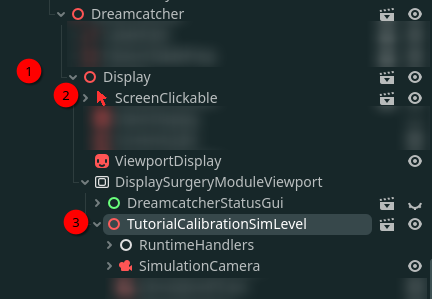
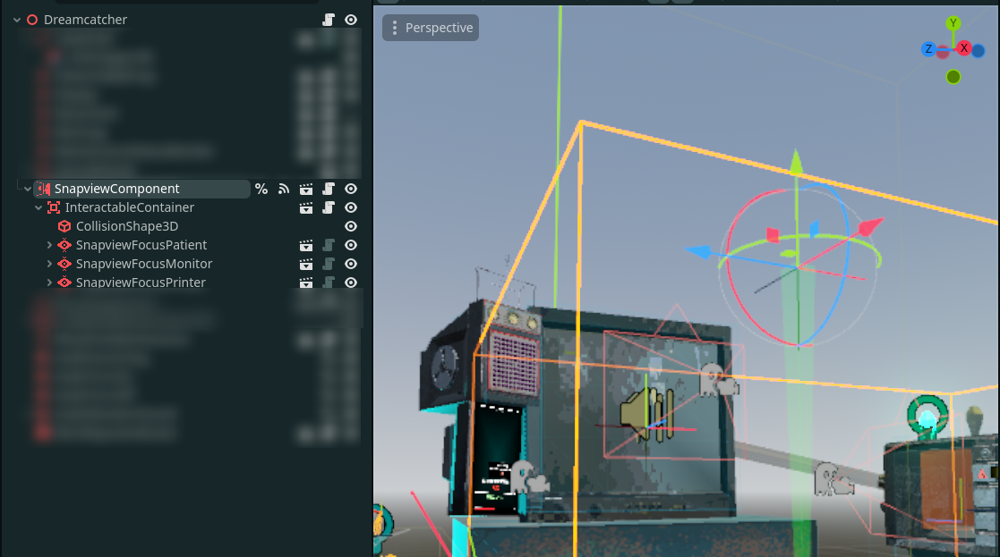

We're developing an indie game called
[**ESSOMENIC**](https://store.steampowered.com/app/4057180/ESSOMENIC/) with
[BRYGD Interactive](https://linktr.ee/BRYGDinteractive). We plan to release in
Q3 2026.

You play a doctor of sorts, following commands by a strange organization, and
operating strange devices and machines that, according to your employer, are
elements of the most important set of surgeries mankind has ever had to deal
with. The Higher Order Bureau has high expectations of you. **Do not fail to
meet them**.

The game is developed with the **Godot Engine 4.5**, using static-typed
GDScript.

<!--more-->

## Noteworthy contributions

I am the main programmer for this project. I handle gameplay programming, as
well as developing engine tools wherever needed. I am also a writer in this
project, as well as pitch deck presenter.

Here's a set of noteworthy developments that I have contributed in for
ESSOMENIC.

### The Display



The DREAMCATCHER is our collection of primary modules. It's where the players'
patients are hooked onto, and it's where the bulk of surgery gameplay and
exploration happens.

In the DREAMCATCHER, the display is easily the most important component. It's
where the memory navigation happens. It's a world within another. `SimLevel`s
(our game's memory maps) are loaded into a Sub-viewport, that is then projected
onto a Sprite3D laying on top of the display.

In this following image, the Display **(1)**, contains a `Clickable` **(2)**,
which is in charge of projecting the mouse position into a world position on the
SimLevel **(3)**.

On the display side, the raycast is projected to a two dimensional coordinate,
that is the position of the mouse if the sprite that intersects it were a
Viewport.

<pre class="language-gdscript">
  <code>
  ## Turns a world position and translates it to coordinates projected on the viewport plane.
  func unproject_world_position(pos: Vector3) -> Vector2:
    # This works so long as the display isn't rotated locally.
    var u_vector := global_basis.x.normalized()*2 # X axis
    var v_vector := global_basis.y.normalized()*2 # Y axis
    var translated_pos := pos - global_position # Local collission position
    var u := (( translated_pos.dot(u_vector) + 1) / 2) * viewport.size.x # X Coordinate
    var v := ((-translated_pos.dot(v_vector) + 1) / 2) * viewport.size.y # Y Coordinate
    return Vector2(u,v)
  </code>
</pre>

On the `SimLevel`, we use the returned value to figure out where the player is
pointing to in the simulation, with a 3D raycast.

<pre class="language-gdscript">
  <code>
  ## Transforms a position on the display screen into a direction for the ray.
  ## If position is Vector2.INF, disables the raycast.
  func update_raycast(pos: Vector2 = Vector2.INF) -> void:
    if pos == Vector2.INF:
      ray.enabled = false
    else:
      ray.enabled = true
      ray.target_position = camera.project_ray_normal(pos) * interaction_range
  </code>
</pre>

### Snapviews

One of the core components of ESSOMENIC is the snapped views the player often
interacts with. Snapview logic has seen a lot of iterations, but we're presently
integrating its logic by making use of
[PhantomCamera](https://phantom-camera.dev/).

`SnapviewComponent`s make use of `SnapviewFocus`es as their locked-in camera
views. Snapview components also include a raycast object, which helps players
interact with Clickable components, both inside the simulation and outside.

When snapped into a `Snapview`, the player will no longer play as a first person
controller, and instead move into a locked-position view, with a specific FOV
and angle. This makes it so that, essentially, the 3D world environment changes
into a UI environment.

### Second-order Dynamic Component

I developed a second-order dynamic script based off of this video for procedural
animation.



What resulted was a component that made its parent object a top-level transform,
and made it follow another object with a configurable frequency, damping, and
initial response. It was mainly used for simulation camera controls, but has the
capacity to be adapted elsewhere. It is a component able to be attached to any
Node3D after all.

Here's a snippet of the final implementation.

<pre class="language-gdscript">
  <code>
  @export_category("Position")
  ## False if the component should not perform position calculations.
  @export var process_position := true
  ## Affects the speed at which the system reacts, as well as its rate of vibration, but doesn't affect the shape.
  @export_range(0.1, 10, 0.1, "suffix:Hz") var position_frequency: float = 1.0
  ## Between 0 and 1 means the system vibrates (bouncy). At 1 and above, the system will not vibrate.
  @export_range(0.1, 10, 0.01, "exp", "suffix:ζ") var position_damping: float = 1
  ## <0: Anticipates movement. 0: Takes some time to start accelerating. 1: Movement is immediate. >1: Overshoots movement.
  @export_range(-10, 10, 0.01, "exp", "suffix:r") var position_initial_response: float = 1.0
  @export_range(0.1, 500, 0.1, "suffix:m/s") var linear_velocity_limit: float = 100

  [...]

  func _update_constants() -> void:
    # Calculate constants
    _pos_k1 = position_damping / (PI*position_frequency)
    _pos_k2 = 1 / pow(2*PI*position_frequency, 2)
    _pos_k3 = position_initial_response * position_damping / (2*PI*position_frequency)

  [...]

  ## Processes the second order dynamic position of the parent object.
  func _position_process(delta: float, _xd_pos: Vector3 = Vector3.INF) -> void:
    # Current position of the target node.
    var _x_pos := _target.global_position

    # If the velocity hasn't been provided, calculate it.
    if(_xd_pos == Vector3.INF):
      _xd_pos = 2 * (_x_pos - _xp_pos) / delta
    _xp_pos = _x_pos

    # Prevent catastrophic failure on lower frame rates.
    var k2_stable: float = max(_pos_k2, 1.1 * (pow(delta,2)/4 + (delta*_pos_k1/2)))

    # Integrate position by velocity.
    _y_pos += delta * _yd_pos

    # Integrate velocity by acceleration.
    _yd_pos += delta * (_x_pos + _pos_k3*_xd_pos - _y_pos - _pos_k1*_yd_pos) / k2_stable

    # Cap the speed
    _yd_pos = _yd_pos.limit_length(linear_velocity_limit)

    _parent.global_position = _y_pos + _pos_offset

  </code>
</pre>

## Reach

We have a Steam store page ready for the game.

<iframe src="https://store.steampowered.com/widget/4057180/" frameborder="0" width="646" height="190"></iframe>

We also have a very early Itch.io demo available, which is heavily subject to
change.



We were nominated for the 2025 Swedish Game Awards' Best Outside the Box
category.

ESSOMENIC is a game born from our game jam —
[Requisition Nostalgium](../game-jams/#requisition-nostalgiumhttpsedneedsbreaditchiorequisition-nostalgium).
It is a game about performing surgery on patient's memories, navigating them and
requisitioning items with high emotional impact.


