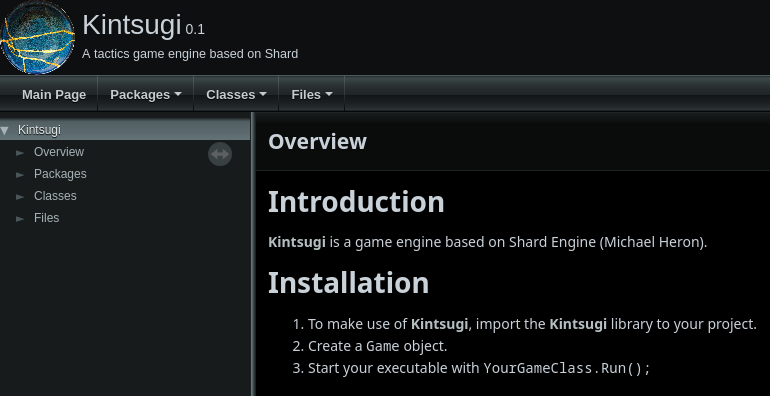
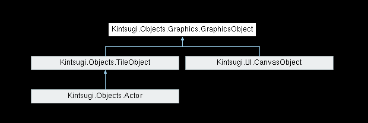
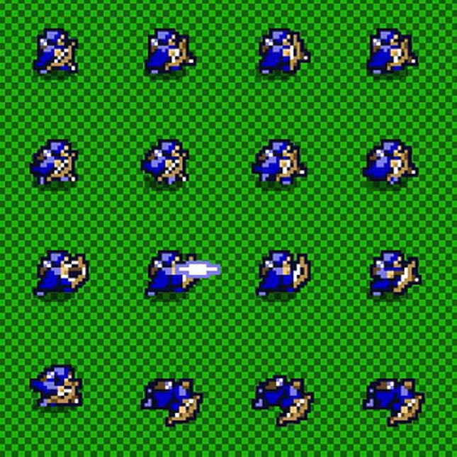

# "An engine twice born."

We developed a custom game engine as part of our
[Game Engine Architecture course at the University of Gothenburg](https://www.gu.se/en/study-gothenburg/game-engine-architecture-dit572).
We took a broken and unfinished engine and turned it into a turn-based strategy
engine by scrapping most of the original codebase into something new and of our
own design.

The engine was developed in **.NET C#** and makes use of
[**SDL2**](https://www.libsdl.org/) for rendering.

<!--more-->

We published a couple demo games developed in the Kintsugi Engine in Itch.io.

<iframe frameborder="0" src="https://itch.io/embed/2758159?border_width=5&amp;bg_color=4c566a&amp;fg_color=d8dee9&amp;link_color=b48ead&amp;border_color=292e39" width="552" height="167"><a href="https://edneedsbread.itch.io/synchronecronomicon">Synchronecronomicous &amp; Desynchrolife by Ed, Buddha, BitiLope</a></iframe>

## My contributions

### Documentation

> 

> <a href="https://gautama.casa/kintsugi/">Access the documentation here.</a>
> 

I love good docs.

I allotted some time to make sure the Kintsugi Engine was documented to the best
of our capacity. I made use of C# Docstrings together with
[Doxygen](https://www.doxygen.nl/index.html) to generate a documentation website
for the engine.

> "How dare you make documentation out of my implementation too." -_Our
> examiner, in jest._

### Tweening



We implemented a sprite movement interpolation system supporting ourselves with
the [TweenSharp NuGet package](https://www.nuget.org/packages/TweenSharp). It
added a considerable level of polish to our demo games.

The function itself is a delegate method, which means the developer may choose
to implement whatever easing function they prefer. The Kintsugi engine exposes
the [TweenSharp NuGet package](https://www.nuget.org/packages/TweenSharp).
Within this library, several useful functions can already be found and used in
this delegate method.

`TileObject`s include an `Easing` property. To set one, the developer needs to
specify the function to use and the length of time it should run for. During
rendering, the `TileObject` will be rendered according to its actual Current
Position as calculated by the `Easing` class.

### TileObject and Actor architecture

`TileObject`s and `Actor`s are essentially what corresponds to a discrete game
object in our engine. The main difference from a game object is that tile
objects exist purely on grids, and as such all logic about them is discrete. A
`TileObject` has a `TileObjectTransform`, and can have a `TileObjectCollider`
and a `TileObjectEasing`. They can be thought of as components that a
`TileObject` can have. The developer does not set these directly, but instead
through functions on `TileObject` such as `AddToGrid()`, `SetCollider()` and
`SetEasing()`. `TileObject`, along with `CanvasObject` from UI, also inherits
from `GraphicsObject`. A `GraphicsObject` is simply an object that has a
graphical component (an `ISpritable`). It contains many versions of
SetSpriteSingle and SetAnimation, that respectively apply a static sprite to the
GraphicsObject or an animation.

`Actor`s inherit from `TileObject`, giving all the same benefits as a
`TileObject`. The only addition is that actors are integrated with the turn
system, giving them hooks for `OnStartTurn()`, `OnEndTurn()`, `OnStartRound()`
and `OnEndRound()`. This combined with the `TileObject` components mean that the
developer has access to everything they need to define behavior of an object on
a grid in a turn based system, without having to worry about complexities of
continuous time and space, and not having to worry about checking for collisions
or how to render the character.

### Spritesheet animations

`TileObject`s can be animated via `Tilesheets` and logic provided by the
developer. `TileObject`s contain the `Graphic` property (through inheritance of
`GraphicsObject`), of type `ISpriteable`. The two `ISpriteable` objects provided
by the engine are `SpriteSingle` and `Animation`, but a developer may choose to
implement their own. The main use of the `ISpriteable` interface is to allow the
object implementing it to define its own source rect.

### Tilemap System

The base of the Kintsugi Engine `TileObject`s are based around `Tilemaps`,
referred to as `Grid`s within the engine. `Grid`s are `GameObject`s that contain
graphics based on `TileSet`s (more on that in
[Tiled Importer](#tiled-importer)), layers, and `TileObject`s located in the
`Grid`.

In terms of the tiles themselves, the `Grid` contains a collection of
`GridLayer`s, which in turn contain a two dimensional array of the height and
width of the `Grid` of `Tile`s. `Tile`s themselves contain the ID of the tile in
its `TileSet`, which defines which source rect to take from which image when
displaying this tile onto the world. `GridLayer`s mostly define rendering order.

`GridLayer`s can also include collision, so they integrate with the Collision
System.

A developer can query what `TileObject`s are present on the grid and on specific
coordinates by virtue of the `TileObject`s dictionary, accessible via dedicated
methods. These methods optimize `TileObject` lookups, which both allows the
developer to query objects in a given coordinate, and adds render filtering so
that displaying `TileObject`s is less expensive.

### Tiled Importer

We implemented the ability to draw maps in a third party tool known as
[Tiled](https://www.mapeditor.org/), and then have it be integrated with a
`Grid` in the engine. In short, a developer can include a “.tmx” file —which is
a Tiled tile map— into the assets folder (along with its dependencies), and
create a `Grid` object based on it.
