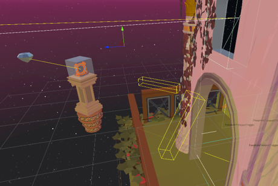
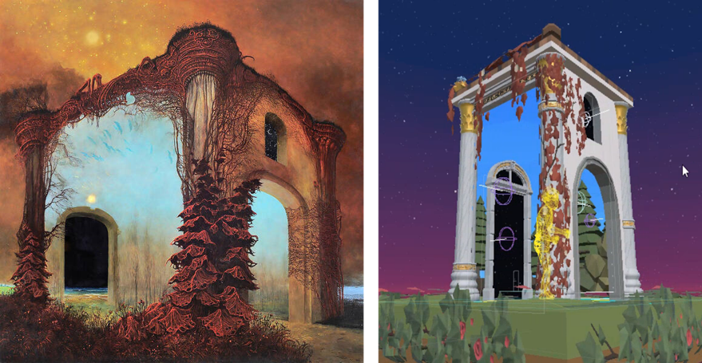
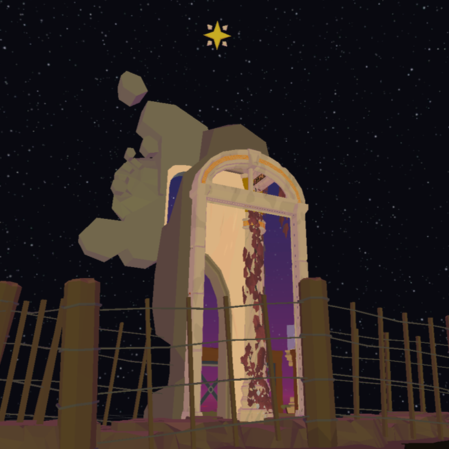
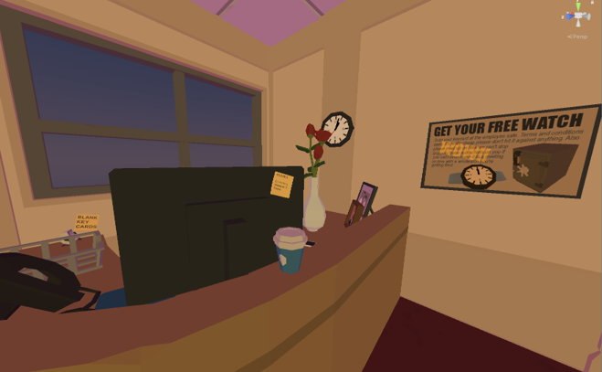
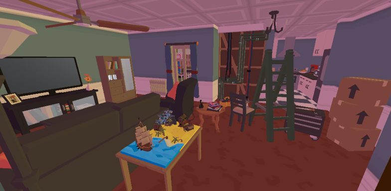
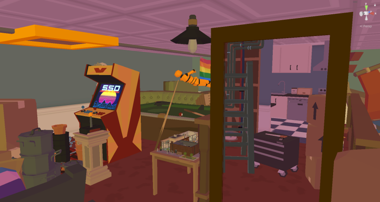

# "Rollback spacetime."

We worked on this game as a group of three for the _Open Project in Interaction
Design_ course at Gothenburg University over the course of 8 weeks. For this
project, our design challenge was to avoid using virtual locomotion systems, and
to bend space as much as possible. For such, we resorted to heavy use of
stationary portals as a means of attaining
[redirected walking](https://en.wikipedia.org/wiki/Redirected_walking).

Developed with **Unity** version 2022.3.21f1.

<!--more-->

The entirety of the game, amassing to 1-2 hours of gameplay, takes place in a
4x4m square. According to position data, players walked an average of 1km per
hour of playtime approximately, all within that area. Much to our surprise,
players rarely felt cramped. Even more surprising, they reported a really good
sense of direction. Even if the virtual space was impossible, it was easy to
navigate and find your way around.

Based on
[_Portal Rendering and Creation Interactions in Virtual Reality_](https://ieeexplore.ieee.org/document/9995211).



# Setting

The player is an Intern Developer in the company in charge of maintaining
imperative reality. Including but not limited to laws of physics, spacetime,
scale, perception, and so on. Unfortunately, someone else in the company has
pushed a broken build onto production, which has caused large scale problems.
Namely, time, scale, and perception are completely broken. Lucky for the company
and for you, however, you happened to have a working build available on your
system, which means you're the only person currently holding a tangible form.
This means it is up to you to manually roll back changes in hopes to reestablish
stable reality.

# The Game

The game is meant to be an escape room. Our sense of interpretation of this
notion was that the player was, indeed, trapped in an impossible space, and that
the urgency of the matter compelled them to do what's necessary to return to
normalcy. Since this was (at least in intention) a vertical slice, we decided to
have three separate "branches" each with a particular theme, and have these be
three challenges that they'd be required to complete in order to proceed in
their search. This would also allow us to better separate work as a team.

## Perspective



This is the branch I worked on. I wanted to play around with viewing angles to
solve puzzles, so I made a lot of the level design dependent on viewing objects
through specific angles or in specific ways in order to progress.

The branch itself was very open ended, as in you could decide which of the
present puzzles to solve first. I took heavy inspiration in an unnamed painting
by Zdzisław Beksiński, which showed a really good opportunity to make use of
static portals to show several environments at once.

## Time



The time branch had a lot of its design dedicated to performing different
actions in different phases. The player would arrive at reception at a time
where they couldn't get their keycard yet. To manipulate time, they made use of
"the infinite hallway", which would advance time the more you walked into it.
The hallway was a square-shaped three-sided path with no end, up until the
player decided to turn back, at which point the exit would just be or or two
corners away.

## Scale



The scale branch had a set of more experimental puzzles along with the big theme
attached to it. Players were able to size themselves up and down through various
means after exploring the area enough, allowing them to enter scale models
present in the room. For instance, players could see a model sized spaceship
sitting on a desk in one room, but visit the inside of the spaceship itself form
another. The video above this shows the inside of the spaceship, and the image
below shows it laying on a table. Also pictured within the spaceship is the room
containing the key, which is accessible as a normal sized person as well.

